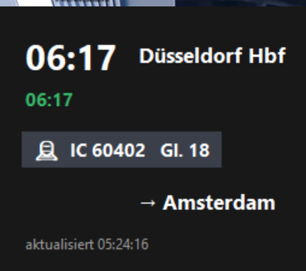

# DB Zugverbindungs-Widget

Ein kleines Desktop-Widget für Windows, das die nächste Abfahrt deiner
Zugverbindung im Look der Bahn-App direkt auf dem Desktop anzeigt –
Abfahrtszeit, Echtzeit/Verspätung, Zug, Gleis und Ziel.

> ⚠️ **Hinweis:** Dieses Projekt (Code, Build-Skript und diese README)
> wurde größtenteils KI-generiert (Claude von Anthropic) und iterativ
> mit echten Fehlermeldungen debuggt. Nutzung auf eigene Verantwortung
> – insbesondere die Datenquelle ist eine inoffizielle, undokumentierte
> Schnittstelle der Deutschen Bahn.



## Funktionen

- Zeigt Abfahrtszeit, Echtzeit-Verspätung (farblich), Zuggattung/-nummer
  und Gleis der nächsten passenden Verbindung
- Filterbar nach Zugtyp (z. B. nur `IC`), Zielbahnhof und/oder konkreter
  Zugnummer
- Rahmenloses, frei verschiebbares, immer im Vordergrund liegendes
  Fenster im dunklen DB-Farbschema
- Einstellungsmenü per Rechtsklick, Einstellungen werden lokal
  gespeichert
- Aktualisiert sich automatisch in einstellbarem Intervall
- Keine Anmeldung, kein API-Key nötig

## Datenquelle

Das Widget nutzt **IRIS** (`iris.noncd.db.de`), die kostenlose,
öffentliche Echtzeit-Schnittstelle der Deutschen Bahn – dieselbe
Datenquelle, aus der auch die Abfahrtstafeln in den Bahnhöfen
gespeist werden. Es ist keine offizielle, dokumentierte API und kann
sich jederzeit ändern.

Die Stationssuche läuft über eine eingebaute Liste der wichtigsten
Fernverkehrsbahnhöfe. Ist deine Station nicht dabei, kannst du
stattdessen direkt ihre **EVA-Nummer** eintragen (zu finden über die
URL der Station auf [bahnhof.de](https://www.bahnhof.de)).

## Installation

### Voraussetzungen

- Windows
- [Python 3.10+](https://www.python.org/) (bei der Installation
  „Add python.exe to PATH" aktivieren)

### Ausführen

```bash
pythonw db_widget.py
```

(`pythonw` statt `python`, damit kein Konsolenfenster im Hintergrund
offen bleibt)

### Einrichtung

Beim ersten Start per Rechtsklick auf das Widget → **Einstellungen**
öffnen und eintragen:

| Feld | Beschreibung |
|---|---|
| Station | Name (aus der bekannten Liste) oder direkt eine EVA-Nummer |
| Zugtyp | optional, z. B. `IC`, `ICE`, `RE` – exakter Abgleich |
| Ziel | optional, Teil des Zielbahnhofnamens |
| Zugnummer | optional, konkrete Zugnummer |
| Aktualisierung | Intervall in Sekunden |

Die Einstellungen werden in `db_widget_config.json` im selben Ordner
gespeichert.

### Bedienung

- **Linke Maustaste halten + ziehen** – Fenster verschieben
- **Rechtsklick** – Einstellungen, manuelles Aktualisieren, Beenden

### Autostart (optional)

Eine Verknüpfung von `db_widget.py` (Ziel: `pythonw.exe db_widget.py`)
in den Ordner `shell:startup` legen (Windows-Taste + <kbd>R</kbd> →
`shell:startup`).

## Als eigenständige .exe bauen

Mit dem mitgelieferten `setup.py` lässt sich das Widget in eine
eigenständige `.exe` packen, die ohne separate Python-Installation
läuft:

```bash
pip install py2exe
python setup.py py2exe
```

Ergebnis liegt danach in `dist/db_widget.exe`.

Falls `py2exe` mit deiner Python-Version Probleme macht (kommt bei
neueren Versionen öfter vor), ist
[PyInstaller](https://pyinstaller.org/) die robustere Alternative:

```bash
pip install pyinstaller
pyinstaller --onefile --windowed --name db_widget db_widget.py
```

## Bekannte Einschränkungen

- IRIS ist eine inoffizielle Schnittstelle ohne Support-Zusage der
  Bahn – Ausfälle oder Änderungen sind jederzeit möglich
- Die eingebaute Stationsliste deckt nur die wichtigsten
  Fernverkehrsknoten ab
- Getestet auf Windows; sollte dank `tkinter` grundsätzlich auch unter
  macOS/Linux laufen, `overrideredirect`/`-topmost`-Verhalten kann dort
  aber abweichen

## Lizenz

Keine explizit angegeben – nutze es, wie es dir passt.
